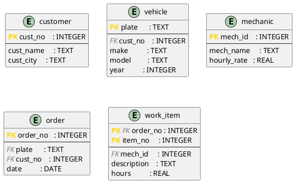

# DBMS_04 – Normalization in Practice: From Plain Text to DDL

**Module:** Databases · THGA Bochum  
**Lecturer:** Stephan Bökelmann · <sboekelmann@ep1.rub.de>  
**Repository:** <https://github.com/MaxClerkwell/DBMS_04>  
**Prerequisites:** DBMS_01, DBMS_02, DBMS_03, Lecture 04 (Normalization)  
**Duration:** 90 minutes

---

## Learning Objectives

After completing this exercise you will be able to:

- Translate a natural-language problem description into a **flat starting table**
- Systematically identify and write down **functional dependencies**
- Decompose the table step by step into **2NF** and **3NF**, verifying losslessness at each step
- Represent the normalized schema as a **PlantUML diagram**
- Implement the schema as **DDL** in SQLite and populate it with sample data
- Formulate three practical **SQL queries** that directly reflect relational algebra

**After completing this exercise you should be able to answer the following questions independently:**

- How do I recognize a partial or transitive dependency in a real table?
- Why is a decomposition only correct if it is lossless?
- When is 3NF sufficient — and when do I need BCNF?

---

## Check Prerequisites

```bash
sqlite3 --version
plantuml -version
git --version
```

> You should see three version strings — SQLite 3.x, PlantUML 1.x, and Git 2.x.
> If a tool is missing, install it:
>
> ```bash
> sudo apt-get install -y sqlite3 plantuml   # Debian / Ubuntu
> brew install sqlite3 plantuml              # macOS
> ```

> **Screenshot 1:** Take a screenshot of your terminal showing all three
> successful version checks and insert it here.
>
> `[insert screenshot]`


---

## 0 – Fork and Clone the Repository

**Step 1 – Fork on GitHub:**  
Navigate to <https://github.com/MaxClerkwell/DBMS_04> and click **Fork**.
Keep the default settings and confirm.

**Step 2 – Clone your fork:**

```bash
git clone git@github.com:<your-username>/DBMS_04.git
cd DBMS_04
ls
```

> You should see only the `README.md`. You will create all further files
> yourself during this exercise.

---

## 1 – The Starting Point: A Workshop and Its Spreadsheet

A small car repair workshop has been managing its repair orders in a single
Excel spreadsheet for years. Each row describes one **work item** within an
order — a single task assigned to a mechanic. The table looks like this
(simplified):

| OrderNo | Date       | CustNo | CustName        | CustCity | Plate       | Make | Model | Year | MechId | MechName   | HourlyRate | ItemNo | Description         | Hours |
|---------|------------|--------|-----------------|----------|-------------|------|-------|------|--------|------------|------------|--------|---------------------|-------|
| 1001    | 2026-03-10 | K01    | Berger, Franz   | Bochum   | BO-AB 123   | VW   | Golf  | 2018 | M03    | Huber, Tom | 65.00      | 1      | Oil change          | 0.5   |
| 1001    | 2026-03-10 | K01    | Berger, Franz   | Bochum   | BO-AB 123   | VW   | Golf  | 2018 | M03    | Huber, Tom | 65.00      | 2      | Replace air filter  | 0.3   |
| 1002    | 2026-03-11 | K02    | Novak, Jana     | Herne    | HER-XY 44   | Ford | Focus | 2020 | M01    | Schulz, P. | 60.00      | 1      | Front brake pads    | 1.5   |
| 1003    | 2026-03-12 | K01    | Berger, Franz   | Bochum   | BO-CD 999   | BMW  | 320i  | 2019 | M03    | Huber, Tom | 65.00      | 1      | Service inspection  | 2.0   |
| 1003    | 2026-03-12 | K01    | Berger, Franz   | Bochum   | BO-CD 999   | BMW  | 320i  | 2019 | M01    | Schulz, P. | 60.00      | 2      | Tyre change         | 0.8   |

The primary key of this flat table is `(OrderNo, ItemNo)` — every combination
of order number and item number appears exactly once.

### Task 1a – Identify Anomalies

Read the table carefully and describe one concrete example of each:

1. **Update anomaly:** Which rows would need to be changed simultaneously if
   mechanic Huber raises his hourly rate to 70.00?
2. **Insert anomaly:** Can a new mechanic be added before they work on their
   first order? What is missing?
3. **Delete anomaly:** What information is permanently lost if order 1002 is
   deleted entirely?

> *Your answers:*Update anomaly: if Huber increases his hourly rate, all rows where he appears must be updated(for example, the two rows of order 1001 and the row of order 1003).Otherwise , some rows would contain the old rate while others would contain the new one.
> Insert anomaly: No mechanic cannot be added before they have worked on their first order, because thre is no separate table to store mechanics. You would have to invent an OrderNo, a Customer, and a car just to insert them.
> Delete anomaly: If order 1002 ist deleted , all information about customer K02(Novak),their city ,their car (a 2020 Ford Focus), and the fact that Schulz worked on it is lost permantly. 

### Task 1b – Write Down Functional Dependencies

List all non-trivial functional dependencies you can identify in the flat table.
Use the notation $X \rightarrow Y$.

Hints:
- Which attributes uniquely determine the customer?
- Which attributes follow from the licence plate alone?
- What does a single mechanic ID determine?
- What only follows from the combination `(OrderNo, ItemNo)`?

> *Your FD list:*CustNo → CustName
CustNo → CustCity

Plate → Make
Plate → Model
Plate → Year

MechId → MechN

OrderNo → Date
OrderNo → CustNo
OrderNo → Plate

(OrderNo, ItemNo) → Date, CustNo, CustName, CustCity, Plate, Make, Model, Year, MechId, MechN


### Questions for Task 1

**Question 1.1:** Is `CustNo → CustCity` a *full* or *partial* dependency with
respect to the primary key `(OrderNo, ItemNo)`? Justify your answer using the
definition from Lecture 04.

> *Your answer:*CustNo → CustCity is a partial dependency, because CustCity depends on only part of the composite primary key (OrderNo, ItemNo), not on the whole key.

**Question 1.2:** Identify a transitive dependency in the flat table and explain
why it violates 3NF.

> *Your answer:*A transitive dependency is OrderNo → CustCity, because OrderNo determines CustNo, and CustNo determines CustCity. This violates 3NF because a non-key attribute (CustCity) depends on another non-key attribute (CustNo) instead of depending directly on a key.

**Question 1.3:** Compute the attribute closure $\{\mathrm{OrderNo}\}^+$ using
your FD list. Is `OrderNo` alone a superkey of the flat table?

> *Your answer:*OrderNo is not a superke, because its cllosure does not include ItemNo, Mechld or MechN.

---

## 2 – Normalization

### Task 2a – Decompose into 2NF

All attributes that depend only partially on the primary key `(OrderNo, ItemNo)`
must be moved into separate relations. Work out the decomposition on paper first,
then fill in the table below.

**Result (fill in):**

| Relation       | Attributes                                         | Primary Key            |
|----------------|----------------------------------------------------|------------------------|
| `customer`     | `cust_no`, `cust_name`, `cust_city`               | `cust_no`              |
| `vehicle`      | `plate`, `make`, `model`, `year`, `cust_no`       | `plate`                |
| `mechanic`     | `mech_id`, `mech_name`, `hourly_rate`             | `mech_id`              |
| `order`        | `order_no`, `date`, `plate`, `cust_no`            | `order_no`             |
| `work_item`    | `order_no`, `item_no`, `mech_id`, `description`, `hours` | `(order_no, item_no)` |

Check: In every relation, does each non-key attribute depend on the **complete**
primary key?

> *Your check:*In every relation, each non‑key attribute depends on the full primary key.
All partial dependencies have been removed: customer data depends only on cust_no, vehicle data depends only on plate, mechanic data depends only on mech_id, and order data depends only on order_no.
In the work_item relation, all attributes depend on the full composite key (order_no, item_no).
Therefore, all relations are in 2NF.

### Task 2b – Decompose into 3NF

Examine `order` and `vehicle` for transitive dependencies.

- In `order`: does `cust_no` depend directly on `order_no`? Does `cust_name`
  transitively depend on it through `cust_no`? *(After the 2NF split,
  `cust_name` should already be in `customer` — verify that this is correct.)*
- In `vehicle`: is there a dependency between `plate` and `cust_no` that
  requires a further split, or is `vehicle` already in 3NF?

State your conclusion: are all five relations from Task 2a already in 3NF?
If not, perform the missing decomposition.

> *Your analysis and any further decomposition:*After the 2NF decomposition, the transitive dependencies have already been removed.
In the order relation, cust_name and cust_city are no longer present, so the transitive dependency order_no → cust_no → cust_city is eliminated.
In the vehicle relation, plate determines all other attributes directly, and there is no transitive dependency involving cust_no.
Therefore, all five relations are already in 3NF, and no further decomposition is needed.

### Task 2c – Verify Losslessness

Pick one of the decompositions you performed (e.g. the split of the original
table into `order` and `vehicle`) and verify it using the **Heath criterion**:

$$R_1 \cap R_2 \rightarrow R_1 \setminus R_2 \quad \text{or} \quad R_1 \cap R_2 \rightarrow R_2 \setminus R_1$$

Name the shared attributes, state the FD you rely on, and conclude whether the
decomposition is lossless.

> *Your verification:*Shared attributes: {plate, cust_no}
FD used: plate → make, model, year
Verification: Since the common attribute plate functionally determines all attributes in vehicle that are not in order, the condition
(R₁ ∩ R₂) → (R₂ \ R₁)
is satisfied.
>  The decomposition is lossless.

### Questions for Task 2

**Question 2.1:** Why must `cust_no` remain as a foreign key in `order` even
though the customer is also reachable via the vehicle's licence plate?
Describe a realistic scenario where the direct link `order → customer` is
necessary.

> *Your answer:*cust_no must remain a foreign key in the order table because the customer who places the order is not always the same as the registered owner of the vehicle. The licence plate only identifies the owner, but workshops often need to record who actually requested and authorized the repair.

A realistic scenario is when the workshop services company or fleet vehicles. The car may be owned by the company, but different employees bring it in for maintenance. The licence plate would only point to the company as the owner, while the workshop must store which specific employee placed the order, approved the work, and should be contacted.

Therefore, the direct relationship order → customer is essential and cannot be removed.

**Question 2.2:** Is the schema after the 3NF decomposition also in BCNF?
Justify your answer using the definition: for every non-trivial FD $X \rightarrow Y$,
$X$ must be a superkey.

> *Your answer:*Yes, the schema after the 3NF decomposition is also in BCNF.  
For every relation, all non-trivial functional dependencies have a left-hand side that is a superkey:

In customer(cust_no, cust_name, cust_city), the only non-trivial FDs are cust_no → cust_name, cust_city, and cust_no is the primary key.

In vehicle(plate, make, model, year, cust_no), the FD plate → make, model, year, cust_no holds, and plate is the primary key.

In mechanic(mech_id, mech_name, hourly_rate), the FD mech_id → mech_name, hourly_rate holds, and mech_id is the primary key.

In order(order_no, date, plate, cust_no), the FD order_no → date, plate, cust_no holds, and order_no is the primary key.

In work_item(order_no, item_no, mech_id, description, hours), the FD (order_no, item_no) → mech_id, description, hours holds, and (order_no, item_no) is the primary key.
Since in each case the determinant of every non-trivial FD is a superkey, the schema is in BCNF.

**Question 2.3:** The hourly rate of a mechanic is stored in `mechanic`. If a
mechanic changes their rate during the year, what problem arises for already
completed orders? How could the schema be extended to correctly record
historical hourly rates?

> *Your answer:*If a mechanic changes their hourly rate during the year, the problem is that all previously completed orders would incorrectly show the new rate instead of the rate that was valid when the work was done. This makes it impossible to reconstruct past invoices accurately and leads to incorrect historical accounting.

To preserve correct historical pricing, the schema can be extended with a separate table that records rate changes over time, for example:  
(mech_id, valid_from, valid_to, hourly_rate).
Each work item would then reference the rate that was valid on the date of the order, ensuring that past orders always reflect the correct historical hourly rate.

---

## 3 – Schema Diagram

### Task 3a – Create the PlantUML File

Create `schema.puml` in the repository directory:

```bash
vim schema.puml
```

> If you have never used Vim, run `vimtutor` in your terminal first — a
> self-contained 30-minute interactive lesson. The essential commands:
> - `i` — enter Insert mode (you can type)
> - `Esc` — return to Normal mode
> - `:w` — save the file
> - `:wq` — save and quit
> - `:q!` — quit without saving

Transfer your normalized schema into PlantUML IE notation. Use the following
skeleton and add the missing attributes and relationships according to your
result from Task 2:



Add the missing relationship lines. Every foreign key relationship needs one
line. PlantUML IE multiplicity notation:

| Notation | Meaning |
|----------|---------|
| `\|\|` | exactly one |
| `o{` | zero or many |
| `\|{` | one or many |
| `o\|` | zero or one |

### Task 3b – Render and Review

```bash
plantuml -tsvg schema.puml
```

Open `schema.svg` in a browser and check:
- Are all five entities visible?
- Does every foreign key relationship show the correct multiplicity?
- Are PK and FK correctly marked?

If you are working on the student server, copy the file to your local machine first:

```bash
scp <username>@<server>:/path/to/DBMS_04/schema.svg ~/Downloads/schema.svg
```

> **Screenshot 2:** Take a screenshot showing the rendered diagram with all
> five entities and their relationships.
>
> `[insert screenshot]`


### Task 3c – Commit

```bash
git add schema.puml
echo "schema.svg" >> .gitignore
echo "*.db"       >> .gitignore
git add .gitignore
git commit -m "docs: normalized schema diagram for workshop management"
```

---

## 4 – DDL: Implement the Schema in SQLite

### Task 4a – Write schema.sql

```bash
vim schema.sql
```

Write `CREATE TABLE` statements for all five relations. Requirements:

- Every table must have an explicit `PRIMARY KEY` constraint.
- Every foreign key must be declared with `ON DELETE` and `ON UPDATE` actions —
  choose the most restrictive action that is still domain-correct.
- `work_item.hours` must be greater than zero: `CHECK (hours > 0)`.
- `mechanic.hourly_rate` must also be greater than zero.
- Use SQLite types only (`INTEGER`, `TEXT`, `REAL`, `DATE`).

<details>
<summary>Solution skeleton — try it yourself first</summary>

```sql
PRAGMA foreign_keys = ON;

CREATE TABLE customer (
    cust_no   INTEGER PRIMARY KEY,
    cust_name TEXT    NOT NULL,
    cust_city TEXT    NOT NULL
);

CREATE TABLE vehicle (
    plate    TEXT    PRIMARY KEY,
    cust_no  INTEGER NOT NULL,
    make     TEXT    NOT NULL,
    model    TEXT    NOT NULL,
    year     INTEGER NOT NULL,
    FOREIGN KEY (cust_no) REFERENCES customer(cust_no)
        ON DELETE RESTRICT ON UPDATE CASCADE
);

CREATE TABLE mechanic (
    mech_id     INTEGER PRIMARY KEY,
    mech_name   TEXT    NOT NULL,
    hourly_rate REAL    NOT NULL CHECK (hourly_rate > 0)
);

CREATE TABLE "order" (
    order_no INTEGER PRIMARY KEY,
    plate    TEXT    NOT NULL,
    cust_no  INTEGER NOT NULL,
    date     DATE    NOT NULL,
    FOREIGN KEY (plate)   REFERENCES vehicle(plate)
        ON DELETE RESTRICT ON UPDATE CASCADE,
    FOREIGN KEY (cust_no) REFERENCES customer(cust_no)
        ON DELETE RESTRICT ON UPDATE CASCADE
);

CREATE TABLE work_item (
    order_no    INTEGER NOT NULL,
    item_no     INTEGER NOT NULL,
    mech_id     INTEGER NOT NULL,
    description TEXT    NOT NULL,
    hours       REAL    NOT NULL CHECK (hours > 0),
    PRIMARY KEY (order_no, item_no),
    FOREIGN KEY (order_no) REFERENCES "order"(order_no)
        ON DELETE CASCADE ON UPDATE CASCADE,
    FOREIGN KEY (mech_id)  REFERENCES mechanic(mech_id)
        ON DELETE RESTRICT ON UPDATE CASCADE
);
```

> Note: `order` is a reserved word in SQL. It must be quoted with double quotes
> in SQLite, or you rename the table to `repair_order` to avoid the conflict
> entirely — which is often the cleaner choice in practice.

</details>

### Task 4b – Load the Schema and Verify

```bash
sqlite3 workshop.db < schema.sql
sqlite3 workshop.db ".tables"
```

> You should see: `customer  mechanic  order  vehicle  work_item`

> **Screenshot 3:** Take a screenshot showing the `.tables` output.
>
> `[insert screenshot]`


### Task 4c – Insert Sample Data

```bash
vim data.sql
```

Insert the data from the flat table in Section 1, now split across the five
normalized relations. Start with the tables that have no foreign keys
(`customer`, `mechanic`), then `vehicle`, then `order`, and finally `work_item`.

<details>
<summary>Sample data — try it yourself first</summary>

```sql
PRAGMA foreign_keys = ON;

-- Customers
INSERT INTO customer VALUES (1, 'Berger, Franz', 'Bochum');
INSERT INTO customer VALUES (2, 'Novak, Jana',   'Herne');

-- Mechanics
INSERT INTO mechanic VALUES (1, 'Schulz, P.', 60.00);
INSERT INTO mechanic VALUES (3, 'Huber, Tom', 65.00);

-- Vehicles
INSERT INTO vehicle VALUES ('BO-AB 123', 1, 'VW',   'Golf',  2018);
INSERT INTO vehicle VALUES ('HER-XY 44', 2, 'Ford', 'Focus', 2020);
INSERT INTO vehicle VALUES ('BO-CD 999', 1, 'BMW',  '320i',  2019);

-- Orders
INSERT INTO "order" VALUES (1001, 'BO-AB 123', 1, '2026-03-10');
INSERT INTO "order" VALUES (1002, 'HER-XY 44', 2, '2026-03-11');
INSERT INTO "order" VALUES (1003, 'BO-CD 999', 1, '2026-03-12');

-- Work items
INSERT INTO work_item VALUES (1001, 1, 3, 'Oil change',         0.5);
INSERT INTO work_item VALUES (1001, 2, 3, 'Replace air filter', 0.3);
INSERT INTO work_item VALUES (1002, 1, 1, 'Front brake pads',   1.5);
INSERT INTO work_item VALUES (1003, 1, 3, 'Service inspection', 2.0);
INSERT INTO work_item VALUES (1003, 2, 1, 'Tyre change',        0.8);
```

</details>

```bash
sqlite3 workshop.db < data.sql
```

Verify the row counts:

```sql
SELECT 'customer',  COUNT(*) FROM customer
UNION ALL SELECT 'mechanic',  COUNT(*) FROM mechanic
UNION ALL SELECT 'vehicle',   COUNT(*) FROM vehicle
UNION ALL SELECT 'order',     COUNT(*) FROM "order"
UNION ALL SELECT 'work_item', COUNT(*) FROM work_item;
```

> Expected: 2, 2, 3, 3, 5.

Commit:

```bash
git add schema.sql data.sql
git commit -m "feat: DDL and sample data for normalized workshop schema"
```

### Questions for Task 4

**Question 4.1:** `ON DELETE CASCADE` was chosen for the foreign key
`work_item.order_no`, but `ON DELETE RESTRICT` for `vehicle.cust_no`.
Justify both choices in terms of the domain — what does it mean for the
business if an order is deleted versus if a customer is deleted?

> *Your answer:*ON DELETE CASCADE for work_item.order_no:  
If an order is deleted, the entire repair job is considered cancelled or removed from the system. Work items cannot exist without their order, so they must be deleted automatically. Cascading the deletion keeps the data consistent.

ON DELETE RESTRICT for vehicle.cust_no:  
A customer cannot be deleted while they still own vehicles. Deleting the customer would leave vehicles without an owner, which makes no sense in the business domain. Restricting the deletion protects the integrity of the data.

**Question 4.2:** Test referential integrity by running:

```sql
PRAGMA foreign_keys = ON;
INSERT INTO work_item VALUES (9999, 1, 3, 'Ghost item', 1.0);
```

What error do you get? What does this tell you about the difference between
a constraint declared in DDL and one that is actually enforced at runtime?

> *Your answer:*yoou get an error similar to:FOREIGN KEY constraint failed. The value order_no = 9999 does not exist in the order table, so SQLite refuses to insert the row.

This demonstrates an important difference:

A constraint declared in the DDL (like a FOREIGN KEY) is only a definition of the rule.

A constraint enforced at runtime is the database actually checking the rule when data is inserted, updated, or deleted.

If foreign key enforcement is turned off (or not supported), the database might accept invalid data even if the DDL declares constraints.
But when enforcement is ON, SQLite actively prevents inconsistent or impossible data from entering the system..
> 


**Question 4.3:** Test the CHECK constraint:

```sql
INSERT INTO work_item VALUES (1001, 3, 3, 'Invalid', -0.5);
```

What happens? What would happen if the CHECK constraint were missing?

> *Your answer:*SQLite returns an error such as: CHECK constraint failed: hours > 0.This happens because the value hours = -0.5 violates the CHECK constraint defined in the table (hours > 0). SQLite therefore refuses to insert the invalid row.

If the CHECK constraint were missing:  
The database would accept the negative value without complaint. This would allow impossible or nonsensical data (negative work hours) to enter the system, which could later cause incorrect calculations, billing errors, or inconsistent business logic.


---

## 5 – SQL Queries

Save all three queries in a file called `queries.sql`. Write a short comment
before each query describing its purpose.

### Task 5a – All Work Items for a Given Customer

**Task:** List all order numbers, order dates, licence plates, item descriptions,
and hours for customer `Berger, Franz`, ordered by date and item number.

Write the relational algebra expression first (in words or formal notation),
then the SQL query.

```sql
-- Query 5a: insert here: 
SELECT 
    o.order_no,
    o.date,
    o.plate,
    w.description,
    w.hours
FROM customer c
JOIN "order" o ON c.cust_no = o.cust_no
JOIN work_item w ON o.order_no = w.order_no
WHERE c.cust_name = 'Berger, Franz'
ORDER BY o.date, w.item_no;

```

<details>
<summary>Expected result</summary>

Four rows: two items from order 1001 (Golf, 2026-03-10) and two items from
order 1003 (BMW 320i, 2026-03-12).

</details>

**Question 5a:** This query joins four tables (`customer`, `order`, `vehicle`,
`work_item`). In what order would the query optimizer ideally perform the joins —
and why does the join order not affect the *result*, but does affect *performance*?

> *Your answer:*The optimizer should start with the most selective tables:

filter the customer,

join to their orders,

join matching work_items,

finally join vehicle.

The join order does not change the result because joins are associative and commutative in relational algebra.
But it does affect performance, since different orders produce very different intermediate table sizes, and a good optimizer tries to reduce data early.

---

### Task 5b – Total Hours per Mechanic in March 2026

**Task:** For each mechanic, compute the sum of all hours worked on orders whose
date falls in March 2026. Show `mech_name`, `total_hours` (rounded to one decimal
place), and `orders` (the number of distinct orders in which the mechanic had at
least one work item). Sort descending by `total_hours`.

```sql
-- Query 5b: insert here :
SELECT 
    m.mech_name,
    ROUND(SUM(w.hours), 1) AS total_hours,
    COUNT(DISTINCT o.order_no) AS orders
FROM mechanic m
JOIN work_item w ON m.mech_id = w.mech_id
JOIN "order" o ON w.order_no = o.order_no
WHERE o.date BETWEEN '2026-03-01' AND '2026-03-31'
GROUP BY m.mech_id
ORDER BY total_hours DESC;

```

<details>
<summary>Expected result</summary>

| mech_name  | total_hours | orders |
|------------|-------------|--------|
| Huber, Tom | 2.8         | 2      |
| Schulz, P. | 2.3         | 2      |

</details>

**Question 5b:** Using `COUNT(DISTINCT order_no)` counts orders, not items.
What would `COUNT(*)` count instead, and why would the result differ in this
case?

> *Your answer:*COUNT(*) counts items,
COUNT(DISTINCT order_no) counts orders — and these are not the same when an order contains multiple work items.

---

### Task 5c – Vehicles with No Repair Order

**Task:** Return the licence plate and model of every vehicle for which
**no** order exists in the database.

Use a set-difference approach with `EXCEPT` and also write an alternative using
`NOT EXISTS`.

```sql
-- Variant 1: EXCEPT
-- Query 5c-1: insert here : 
SELECT plate, model
FROM vehicle
EXCEPT
SELECT v.plate, v.model
FROM vehicle v
JOIN "order" o ON v.plate = o.plate;


-- Variant 2: NOT EXISTS
-- Query 5c-2: insert here : 
SELECT v.plate, v.model
FROM vehicle v
WHERE NOT EXISTS (
    SELECT 1
    FROM "order" o
    WHERE o.plate = v.plate
);

```

<details>
<summary>Expected result</summary>

With the data from Task 4c there are no matches — all three vehicles have at
least one order. Insert a fourth vehicle without an order to test the query:

```sql
INSERT INTO vehicle VALUES ('BOT-ZZ 1', 1, 'Toyota', 'Yaris', 2022);
```

After that, the query should return `BOT-ZZ 1 | Yaris`.

</details>

**Question 5c:** `EXCEPT` and `NOT EXISTS` are logically equivalent — they
always produce the same result. Are there situations where one approach should
be preferred in practice? Consider readability and extensibility.

> *Your answer:*Use EXISTS / NOT EXISTS for clarity and when queries grow more complex;
use EXCEPT when expressing a clean set difference between two simple result sets.

---

Commit:

```bash
git add queries.sql
git commit -m "feat: three SQL queries on normalized workshop schema"
```

---

## 6 – Reflection

**Question A – Normalization and redundancy:**  
The original flat table had 5 rows and 15 columns. The normalized schema has
5 tables. At which data volume does normalization pay off most — at 5 rows or
at 50,000? Justify with concrete reference to the anomalies from Task 1a.

> *Your answer:*Normalization pays off far more at 50,000 rows than at 5.
With only 5 rows, the anomalies from Task 1a (update, insert, delete anomalies) are minor. But with 50,000 rows, redundancy becomes dangerous:

Update anomaly: the same customer or vehicle data appears thousands of times — one missed update creates inconsistencies.

Insert anomaly: adding one fact forces you to repeat lots of unrelated data.

Delete anomaly: deleting one order could accidentally remove the only copy of important information.

In the normalized schema, each fact is stored once, so these anomalies disappear.
The larger the dataset, the more normalization prevents errors and wasted storage — which is why it pays off most at large volumes.

**Question B – 3NF vs. BCNF:**  
Lecture 04 explains that BCNF is not always dependency-preserving. Is this
relevant for the workshop schema? Would a BCNF decomposition have looked
different from the 3NF decomposition here?

> *Your answer:*BCNF adds nothing here — the workshop schema is already “BCNF‑clean,” so 3NF and BCNF are identical in practice.

**Question C – Redundant foreign key in `order`:**  
`order` contains both `plate` (FK → `vehicle`) and `cust_no` (FK → `customer`).
Since `vehicle` itself contains `cust_no`, one might argue that `cust_no`
in `order` is redundant and violates 3NF. Is that correct? When would such
a deliberate denormalization be justified?

> *Your answer:*It’s not a 3NF violation because cust_no in order is a separate, meaningful fact. Denormalization is acceptable when it preserves history or improves performance.

**Question D – NULL and order status:**  
An order that has just been created may have no work items yet. What does the
current schema say about this case? Would the schema need to be extended to
correctly represent an order's status (open / completed)? Sketch the necessary
change.

> *Your answer:*If we want to represent the order’s status correctly, the schema needs an explicit attribute, for example:ALTER TABLE "order"
ADD COLUMN status TEXT CHECK (status IN ('open', 'completed')) DEFAULT 'open';The current schema allows orders without items, but it cannot express their status. Adding a status column solves this cleanly.
> 


> **Screenshot 4:** Take a screenshot showing the output of Query 5b directly
> in `sqlite3` (with `.headers on` and `.mode column` activated).
>
> `[insert screenshot]`


---

## Bonus Tasks

1. **Hourly rate history:** Design a schema extension that allows recording a
   mechanic's hourly rate historically — i.e. which rate applied at the time a
   specific order was processed. Write the modified `CREATE TABLE` statements.

2. **Spare parts:** The workshop also charges for parts in addition to labour.
   Extend the schema with a `part` table and a `order_part` join table that
   records which parts were used in which order. Maintain normal form and
   referential integrity.

3. **Total invoice per order:** Write a query that computes the total amount for
   each order: the sum of `hours × hourly_rate` across all work items. Which
   tables need to be joined?

4. **GitHub Actions:** Add a workflow file `.github/workflows/release.yml` that
   installs PlantUML, renders `schema.puml` to `schema.svg`, and publishes it
   as a release artifact on every `v*` tag. Trigger a release with
   `git tag v1.0.0 && git push --tags`.

---

## Further Reading

- E. F. Codd (1972): *Further Normalization of the Data Base Relational Model.* In: Rustin (ed.): Data Base Systems.
- [SQLite – CHECK Constraints](https://www.sqlite.org/lang_createtable.html#check_constraints)
- [SQLite – Foreign Key Support](https://www.sqlite.org/foreignkeys.html)
- [PlantUML – Entity Relationship Diagram](https://plantuml.com/ie-diagram)
- Lecture 04 handout – *Normalization*
